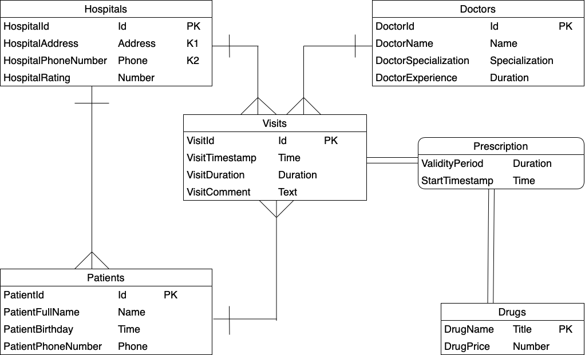

# База данных "Поликлиника"

## Описание

Существует сеть поликлиник "Ресо", оказывающих различную медицинскую помощь людям. У каждой поликлиники есть свой
уникальный номер и номер телефона, по которому можно обратиться за помощью. По всему городу N расположено несколько
поликлиник, их количество с каждым годом растет. Доктора могут перемещаться между поликлиниками в зависимости от
загруженности. У каждого доктора есть своя специализация. Поликлинику или врача можно выбрать по рейтингу поликлиники
или по стажу работы врача. При записи пациенту сообщается в какой поликлинике, в каком кабинете и у какого врача будет
происходить прием. Создается запись на визит, содержащая информацию о дате, времене визита и дополнитльеной информации.
Каждый пациент прикреплен к определенной поликлинике, в которой лежит его персональная карточка с ФИО, датой рождения,
контактным телефоном. Также доктор может назначить рецепт из списка препаратов, имеющих определенную стоимость в аптеке.
У рецепта ограниченный срок действия.

## Построение отношений

В результате предварительного проектирования были выделены следующие отношения и атрибуты:

- Doctors - отношение, содержащее информацию о докторах
    - DoctorId - уникальный идентификатор
    - DoctorName - ФИО
    - DoctorSpecialization - специализация
    - DoctorExperience - стаж работы

Функциональные зависимости:

DoctorId -> { DoctorName, DoctorSpecialization, DoctorExperience }

Ключ: { DoctorId }

- Hospitals - отношение, содержащее информацию о поликлинике
    - HospitalId - уникальный идентификатор
    - HospitalAddress - адрес поликлиники
    - HospitalPhoneNumber - номер телефона поликлиники
    - HospitalRating - рейтинг поликлиники

Функциональные зависимости:

HospitalId -> { HospitalAdress, HospitalPhoneNumber, HospitalRating }

HospitalAdress -> { HospitalId, HospitalPhoneNumber, HospitalRating}

HospitalPhoneNumber -> { HospitalId, HospitalAdress, HospitalRating}

Ключ: { HospitalId }, { HospitalAdress }, { HospitalPhoneNumber }

- Patients - отношение, содержащее информацию о пациенте
    - PatientId - уникальный идентификатор
    - PatientFullName - ФИО
    - PatientBirthday - дата рождения
    - PatientPhoneNumber - номер телефона
    - MainHospitalId - уникальный идентификатор поликлиники, к которой прикреплен пациент

Функциональные зависимости:

PatientId -> { PatientFullName, PatientDateBirth, PatientPhoneNumber , MainHospitalId }

Ключ: { PatientId }

- Visits - отношение, содержащее информацию о визитах
    - VisitId - идентификационный номер визита
    - DoctorId - уникальный идентификатор доктора
    - PatientId - уникальный идентификатор пациента
    - HospitalId - уникальный идентификатор поликлиники
    - VisitTimestamp - точная дата и время визита
    - VisitDuration - продолжительность визита
    - VisitComment - дополнительная информация

Функциональные зависимости:

{ VisitTimestamp, DoctorId } -> { PatientId, HospitalId, VisitComment, VisitDuration, VisitId }

{ VisitTimestamp, PatientId } -> { DoctorId, HospitalId, VisitComment, VisitDuration, VisitId }

{ VisitId } -> { DoctorId, PatientId, HospitalId, VisitTimestamp, VisitComment, VisitDuration }

Ключ:

{ VisitTimestamp, DoctorId }, { VisitTimestamp, PatientId }, {VisitId}

- Drugs - отношение, содержащее информацию о лекарствах
    - DrugName - название лекарства (является уникальным)
    - DrugPrice - цена лекарства

Функциональные зависимости:

{DrugName} -> {DrugPrice}

Ключ: { DrugName }

- Prescription - отнощение, содержащее информацию о выписанных пациенту лекарствах
    - VisitId - уникальный идентификатор визита
    - DrugName - название лекарства
    - ValidityPeriod - срок действия рецепта (в днях)
    - StartTimestamp - когда был выдан рецепт

Функциональные зависимости:

{VisitId, DrugName} -> {ValidityPeriod, StartTimestamp}

Ключ: { VisitId, DrugName }

## ERM

По умолчанию связи необязательные. Атрибуты по умолчанию обязательные.

## PDM

## DDL

см. файл ddl.sql

## Описание запросов

1) Посмотреть информацию о пациентах, которые были на приеме у заданного врача
2) Кому и кем назначен заданный препарат (вывести id)
3) По адресу поликлиники, дате, ФИО врача найти существующие записи на посещение
4) Вся информация о том, что было назначено заданному пациенту (ФИО) за все время
5) По поликлинике и дате найти количество записей
6) Добавить запись пациента к заданному врачу в заданную поликлинику на заданное время
7) У каких врачей был пациент
8) Добавить нового пациента в систему
9) Выдать рецепт пациенту на препарат в рамках визита
10) Обновить стаж работы врача
11) Обновить цену на препарат
12) Обновить комментарий к посещению
13) Удалить пациента из системы

## Реализация запросов на SQL (PostgreSQL 14)

см. файл requests.sql
